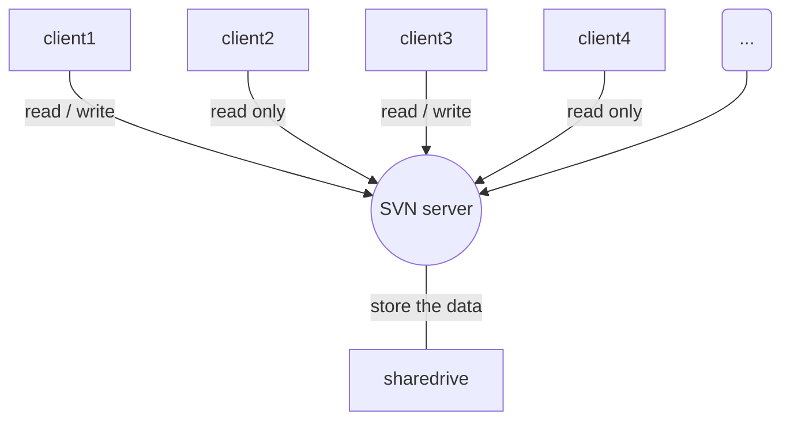

formula1:
$$n==x$$

段内插入LaTeX代码是这样的：$\exp(-\frac{x^2}{2})$

```mermaid
graph TD
    client1-->|read / write|SVN((SVN server))
    client2-->|read only|SVN
    client3-->|read / write|SVN
    client4-->|read only|SVN
    client5(...)-->SVN
    SVN---|store the data|sharedrive
```
